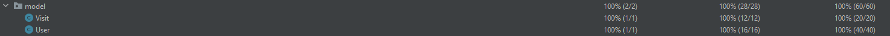
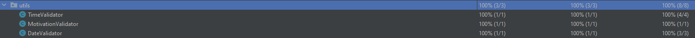

# MENTCARE #

Laura Canaia VR489361    
Stefano Modenese VR491230

## Informazioni generali ##

Il progetto è stato sviluppato utilizzando come IDE Intellij IDEA Community Edition, come supporto per la gestione delle 
dipendenze Gradle versione 2.3.2 utilizzando come linguaggio di programmazione Java versione 14 per il backend, html e CSS
per quanto riguarda il frontend.

Il testing utilizza selenium e junti 4.12.

****

## Processo di sviluppo ##

Il processo di sviluppo si è svolto prendendo spunto da alcuni metodologie che provengono dalle tecniche agile approfondite
in classe. In particolare abbiamo adottato delle tecniche provenienti dall'xtreme programming in quanto puntavamo ad avere
delle releases di prodotto utilizzabili in un periodo di tempo più breve rispetto, ad esempio,  ai cicli di sprint tipici 
del metodo scrum.      
Sempre prendendo spunto dai metodi agile, abbiamo mantenuto il linguaggio informale per discutere delle nuove features da
implementare, il design semplice del componente e il coordinamento periodico (questo solo tramite via chat) per capire come 
procedesse lo sviluppo in generale.        

Lo sviluppo nello specifico lo abbiamo portato avanti procedendo assagnandoci delle task e lavorando in simultanea, 
utilizzando come supporto GitHub per il versionamento utilizzando principalmente 3 branches :
1) Main : su cui andavamo a pushare la versione più completa e funzionante del sistema fino a quel momento;
2) Develop : nel quale si pushavano i rework e delle modifiche rispetto al sistema sviluppato;
3) feature/nomeNuovaFeature : in cui si andava a sviluppare una nuova funzionalità e veniva testata prima di aggiungerla a develop.

Coordinamento e aggiornamento è avvenuto quasi unicamente via Telegram,per aggiornamenti meno importanti, e Discord, per 
eventuali problemi riscontrati e discussione su come procedere con il progetto.

****

## Requisiti ##
Il componente che siamo andati a sviluppare è essenzialmente un'interfaccia per permettere l'accesso agli utenti ad un 
sistema di prenotazione visite.       
Il sistema permette ai pazienti di effettuare un login (o di registrarsi nel caso non lo fossero) e di visualizzare le visite
prenotate con la possibilità di modificarle, eliminarle oppure andare a prenotare una nuova visita attraveso una schermata preposta
che permetterà di prenotare una nuova visita andando a compilare un apposito form.      
Ogni prenotazione permette agli utenti di specificare la data in cui si vuole prenotare la visita, l'orario in cui svolgere 
la suddetta visita e la motivazione che spinge il paziende al volerla prenotare.

Il sistema ha bisogno di :
- un database in cui andare a salvare i dettagli dei pazienti registrati;
- un database per andare a inserire le visite prenotate associate ad ogni utente

Il sistema permentte di gestire solo due tipologie di utente :
- Utenti registrati : che hanno completo accesso al sistema con le informazioni a loro associate;
- Utenti non registrati : i quali potranno accedere al sistema solamente dopo essersi registrati tramite la schermata apposita.

Gli utenti possono andare a compiere azioni sulle visite, ma solamente su quelle che vengono associate al loro account di sistema.
Un utente che ha avuto accesso al sistema può anche effettuare il log out.

****

## Scenari ##

Gli scenari sono stati modellati partendo dall'idea di implementare tutte le informazioni esplicitate nella sezione dei requisiti.    
Partendo da questo presupposto, sono stati modellati i seguenti sette scenari : 

### 1. Login ###
__Assunzioni iniziali :__ L'utente si è appena collegato al sito e si interfaccia con la pagina di Login.       
Se l'utente si fosse precedentemente connesso, ora deve ri-loggarsi in modo da poter accedere al sistema.       
__Funzionamento standard :__ La schermata si presenta come un semplice form nel quale viene richiesto all'utente
di loggarsi inserendo il proprio nome utente, password e cliccare il pulsante di login per poter effettuare l'accesso.
Se l'utente sa di non essere registrato, è presente anche un pulsante per permettere di registrarsi.     
__Possibili funzionamenti errati :__ se l'utente tenta di loggarsi senza prima essersi registrato, il sistema 
mostra un messaggio di errore all'utente chiedendo di reinserire le credenziali oppure di registrarsi al sistema.
__Altre attività :__ si presuppone che ogni utente abbia uno username unico che viene specificato in fase di registrazione
__Cosa succede in caso l'esecuzione vada a buon fine :__ l'utente accede senza problemi nel sistema e passa ad un'altra pagina

### 2. Registrazione ###
__Assunzioni iniziali :__ L'utente non possiede un account e accede alla schermata di registrazione tramite il 
pulsante presente sulla schermata di login.   
__Funzionamento standard :__ L'utente si registra al sistema tramite la compilazione del form inserendo : username, nome, cognome,
codice fiscale, password. Dopo aver inserito tutti i parametri l'utente deve cliccare il pulsante "registrati".   
__Possibili funzionamenti errati :__ Ci sono diversi possibili comportamenti inattesi che possono portare il sistema in
errore :    
a) Se i campi non sono stati tutti compilati, l'utente riceve un messaggio di errore dedicato;    
b) Se il codice fiscale non è valido, nella schermata compare un messaggio di errore dedicato;     
c) Se la password non rispetta le indicazioni date, viene restituito un messaggio di errore dedicato;        
d) Se l'utente, in fase di registrazione, inserisce uno username già presente nel database il sistema richiede di inserire un nuovo username.
__Cosa succede in caso l'esecuzione vada a buon fine :__ l'utente viene registrato correttamente e viene reindirizzato
alla schermata di login dove potrà accedere al sistema inserendo le credenziali appena create.

### 3. Home Page ###
__Assunzioni iniziali :__ L'utente ha effettuato l'accesso al sistema.    
__Fuznionamento standard :__ All'utente si presenta una pagina con il proprio username, con a fianco ad esso 2 pulsanti : il 
pulsante di logout e quello di prenotazione di una nuova visita.   
Sotto di esso vi è una tabella con tutte le visite che sono in programma e, per ogni 
visita nella tabella, c'è la possibilità di modificarla o di cancellarla tramite un pulsante a fianco.    
__Possibili funzionamenti errati :__ essendo una pagina "di passaggio" per altri scenari, l'utente non può direttamente
causare dei funzionamenti inaspettati.     
__Altri funzionamenti__ : Il sistema ha già al suo interno una visita modificabile dall'utente loggato.    
__Cosa succede in caso l'esecuzione vada a buon fine :__ L'utente riesce ad accedere alla sezione collegata al pulsante
o effettua il logout

### 4. Prenotazione visita ###
__Assunzioni iniziali :__ L'utente ha effettuato l'accesso e proviene dalla pagina della home page. Inoltre supponiamo
che tutti gli orari di visita e tutti i giorni sia possibile effettuare delle visite.   
__Funzionamento standard :__ Per la prenotazione della visita, l'utente deve scegliere un giorno e un orario e successivamente inserire una motivazione (breve) 
del motivo per il quale si intende prenotare una visita.
Dopo aver compilato tutti i campi,l'utente deve premere il pulsante "prenota" e viene reinderizzato alla Home Page.   
__Possibili funzionamenti errati :__ Se il form è vuoto viene segnalato all'utente che non può effettuare la prenotazione. 
Se, invece, supera i caratteri disponibili, l'inserimento viene bloccato e segnalato.    
__Altre attività :__ Se l'utente clicca sul pulsante della Home Page senza aver prenotato la visita, tutto quello che 
era stato selezionato o modificato viene perso.    
__Cosa succede in caso l'esecuzione vada a buon fine :__ La prenotazione viene salvata, l'utente torna alla Home Page
e viene visualizzata la visita appena effettuata nella tabella della schermata principale.

### 5. Modifica Visita ###
__Assunzioni iniziali :__ L'utente ha effettuato l'accesso e nel database collegato all'utente è presente almeno una 
visita.    
__Funzionamento standard :__ L'utente può modificare il giorno, l'ora e la motivazione della visita, usando tutti i criteri
illustrati nella sezione 
[Prenotazione visita](https://github.com/LauraCanaia/Elaborato_Ing_Sw?tab=readme-ov-file#4-prenotazione-visita).   
__Possibili funzionamenti errati :__ Sono i medesimi esplicati nella sezione 
[Prenotazione visita](https://github.com/LauraCanaia/Elaborato_Ing_Sw?tab=readme-ov-file#4-prenotazione-visita)
come anche per la sezione "Altre attività".          
__Cosa succede in caso l'esecuzione vada a buon fine :__ Si ritorna alla Home Page e la visita selezionata in 
precedenza è stata aggiornata.   

### 6. Cancellazione visita ###
__Assunzioni iniziali :__ L'utente ha effettuato l'accesso e nel database collegato all'utente è presente almeno una
visita.   
__Funzionamento standard :__ Cliccando il pulsante "Elimina" l'utente elimina la visita dalla tabella e quindi anche 
dal database.    
__Possibili funzionamenti errati :__ Non sono presenti funzionamenti errrati che possono essere compiuti dall'utente in
quanto per l'eliminazione non vi è alcuna interazione con l'utente se non quella con il pulsante "Elimina".    
__Cosa succede in caso l'esecuzione vada a buon fine :__ Nella tabella delle visite non compare più la visita 
selezionata in precedenza.

### 7. Logout ###
__Assunzioni iniziali :__ L'utente ha effettuato l'accesso al sistema.    
__Funzionamento standard :__ Cliccando il pulsante logout l'utente esce dal sistema.
__Possibili funzionamenti errati :__ Non sono presenti funzionamenti errrati che possono essere compiuti dall'utente in
quanto per l'eliminazione non vi è alcuna interazione con l'utente.    
__Cosa succede in caso l'esecuzione vada a buon fine :__ Dopo aver cliccato il pulsante per il logout, l'utente esce
dal sistema e torna alla schermata di Login.

****

## Testing e Refactoring ##

Per quanto riguarda il testing, ci siamo assicurati di scrivere i testi in modo che andassero a simulare dei comportamenti 
che possono essere svolti dagli utenti in un contesto reale.
I test che sono stati scritti e valutati sono stati divisi in 2 categorie:
- Unit Test : test che sono stati compiuti su tutte le classi del package [model](src/main/java/demo/model) e del package 
[utils](src/java/demo/utils);
- End to end test : test che interagiscono con la ui del sistema utilizzano selenium e andando a compiere azioni simili a 
quelle che farebbe un utente andando a garantire il funzionamento corretto dell'applicazione.
I test tra l'interazione tra i componenti del sistema non sono stati necessari da implementare in quanto Spring MVC se ne
occupa intrinsicamente.

Per evitare che il codice subisse un inevitabile degrado ,durante l'implementazione di nuove feature o durante le modifiche
nel caso alcuni casi di test avessero messo alla luce errori di logica, il codice è stato continuamente revisionato subendo
di conseguenza refactoring.
Il refactoring è stato compiuto in contemporanea allo svilupp.

### Unit test ###
Gli unit test, come scritto in precedenza, si sono concentrati sul package model e sul package utils, e in particolare 
sul testare il comportamento su ciascun metodo facente parte di ciascuna delle classi.        
Per le classi model, [user](src/main/java/demo/model/User.java) e [visit](src/main/java/demo/model/Visit.java),
si è deciso di scrivere un test che testasse sia i metodi getter e setter, che i costruttori, e sia anche la logica interna.

Per la scrittura degli unit test di model ci siamo assicurati di raggiungere una coverage il più alto possibile per verificare che
ogni metodo venisse testato almeno una volta.
La coverage raggiunta da questa tipologia di test è stata verificata tramite il tool integrato di Intellij e la coverage dei metodi 
raggiunta è del 100% :

Anche per quanto riguarda le classi di utils([DateValidator](src/main/java/demo/utils/DateValidator.java), 
[MotivatorValidator](src/main/java/demo/utils/MotivationValidator.java) e [TimeValidator](src/main/java/demo/utils/TimeValidator.java))
ci siamo preoccupati di raggiungere il 100% della coverage. Ma essendo classi di supporto con delle funzioni di check sono 
stati scritti essenzialmente 2 test per classe :

